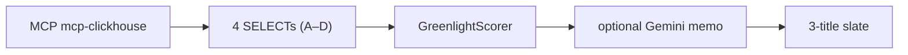

# Catalog Greenlight

**Agentic Cinema Hackathon — ClickHouse Track**

[](https://catalog-greenlight.onrender.com)
[](https://youtu.be/Q_MOBA7Thc4)
[](https://catalog-greenlight.onrender.com/judge)
[](./LICENSE)
[](https://github.com/ClickHouse/mcp-clickhouse)
[](https://ai.google.dev/)
[](https://devpost.com/software/catalog-greenlight)

> **ClickHouse measures. TypeScript scores. Gemini explains.**

A streaming **programming chief** has to pick three catalog titles to push each week — and defend that slate with numbers. Catalog Greenlight measures the catalog in **ClickHouse** through official **mcp-clickhouse**, ranks the slate with a published **TypeScript scorer**, and lets **Gemini** write the memo only.

**Live:** https://catalog-greenlight.onrender.com · **[Judges](https://catalog-greenlight.onrender.com/judge)** · **[Video (English, ~2:43)](https://youtu.be/Q_MOBA7Thc4)** · **[User guide](https://catalog-greenlight.onrender.com/guia)** · **[GitHub](https://github.com/armandobecerraro/catalog-greenlight)**

---

## 60-second judge path

1. **Warm** — Open [catalog-greenlight.onrender.com](https://catalog-greenlight.onrender.com). Render free tier: wait until health shows `ready: true` (~60–90s after spin-down). `GET /api/v1/health` → `clickhouse: connected`, `mcp: mcp-clickhouse`.
2. **`/`** — **Greenlight this week**: Decision Cockpit (measured / ranked / Gemini status), three ranked titles, cannibal exclusions above the fold, Formula Playground (preview only). Provenance names mcp-clickhouse + the TypeScript scorer. Review → confirm → export CSV/JSON (`greenlight-slate-YYYY-MM-DD.*`).
3. **`/ask`** — Chip *“Which genre is under-represented in our catalog?”* → 6-step timeline → **SQL** + **gap_score** (revenue share minus title share) from live ClickHouse rows. The winning genre is **measured**, not hardcoded — ingest on `/ingest` changes the catalog, so the cited genre can move.
4. **`/judge`** — Pitch, Remove-ClickHouse wedge, hosted benchmarks, jury-evidence JSON.

**Honest warm p50** (Render + ClickHouse Cloud, 2026-09-03): ~11s cached greenlight · ~37s `?refresh=1` · ~33s `/ask`. Samples: [`docs/submission/BENCHMARKS.md`](./docs/submission/BENCHMARKS.md). Judging-week keep-alive: `bash scripts/keepalive-smoke.sh` (health only — do not cron `?refresh=1`).

Gemini synthesis is optional on the critical path: if it times out (25s), errors, or hits 429, the three scorer picks and the ClickHouse numbers still return HTTP 200.

---

## What it does

| Route | Job |
| ----- | --- |
| `/` | Weekly **catalog slate** — Decision Cockpit + Formula Playground (preview) + Review→export |
| `/ask` | Natural-language catalog Q&A — Gemini plans SQL; MCP executes; answer cites returned rows |
| `/catalog` | Full title table from ClickHouse |
| `/ingest` | Add a title (Gemini enrich + MCP INSERT) — grows the **same** hosted tables |
| `/judge` | One-screen verify packet for this track |
| `/guia` | In-app user guide (EN/ES); `/about` redirects here |

**User:** programming chief at a small Latin/US streaming studio — not a filmmaker production agent. **Output:** three titles to push this week, with evidence.

**Demo catalog:** Docker and a clean hosted seed load a **synthetic** Latin/US slate (~200 story titles + filler filtered from the ritual) so genre gaps, WoW momentum, and cannibalization are visible without partner data. `/ingest` appends to the live tables, so hosted `totalEntries` can exceed the seed. **Real partner ingest** (S3/Parquet, rights, production ETL) is deliberate future work. The hackathon proof is runtime measurement + a transparent scorer.

---

## Remove ClickHouse and the weekly greenlight cannot measure

Without ClickHouse / `mcp-clickhouse` there are no genre-gap or revenue-share measurements, no week-over-week title momentum, no cannibalization pairs, no slate-hole `gap_score`, and nothing for the TypeScript scorer to rank. Gemini never invents the slate.

| Query id | What it measures |
| -------- | ---------------- |
| `A_genre_inventory` | Genre mix: title counts vs 4-week revenue |
| `B_title_momentum` | Week-over-week title revenue (`wow_pct`) |
| `C_cannibalization` | Near-duplicate title pairs that split the same audience |
| `D_slate_holes` | Genre and language holes (`gap_score`) |

**Scorer** (`packages/orchestration/src/greenlight/GreenlightScorer.ts`) — not Gemini:

```
opportunity = 0.4×genre_gap + 0.4×wow_momentum − 0.2×cannibalization_penalty + 0.05×language_gap
```

`genre_gap` is min–max scaled from `A_genre_inventory`. `language_gap` is the raw `D_slate_holes` language `gap_score` (clamped ≥ 0) — same number a ClickHouse judge re-derives from SQL; it is **not** max-normalized.
Genre diversity: at most one pick per genre when the candidate pool has ≥3 genres. Seed-filler titles (`Fading Line N`, `Catalog Extra…`) are excluded from the ritual.

**Code path:** `McpClickHouseConnector.ts` (official MCP `run_query` / `list_databases` / `list_tables` only — no `@clickhouse/client` in product packages) → `AgentRunner.ts` / `GreenlightAnalyst.ts` → `GreenlightScorer.ts`. Gemini (`@google/genai`) synthesizes the memo and, on `/ask`, plans NL→SQL. It does **not** plan greenlight SQL.

---

## Demo video

**YouTube (public, English, native CC):** https://youtu.be/Q_MOBA7Thc4 (~2:43)

Recorded against the **hosted** app (not localhost). Shot list / teleprompter: [`docs/submission/VIDEO_CHECKLIST.md`](./docs/submission/VIDEO_CHECKLIST.md). Same URL is on [Devpost](https://devpost.com/software/catalog-greenlight).

The video walks `/` (three scored picks + mcp-clickhouse) → `/ask` (grounded `gap_score` + SQL) → Remove ClickHouse → live URL + GitHub. Treat on-screen **metrics as a snapshot**: re-run `/ask` on the live site for the current `gap_score` (the cited genre can be Thriller, Documentary, or another slice as the catalog changes).

---

## Runtime evidence (imported and called)

### Google Cloud AI — `@google/genai` (not Agent Builder / ADK)

| File | Role |
| ---- | ---- |
| `packages/infrastructure/src/gemini/generateContent.ts` | `GoogleGenAI` + `models.generateContent` |
| `packages/infrastructure/src/gemini/GeminiEnrichmentAdapter.ts` | Ingest enrichment |
| `packages/infrastructure/src/gemini/GeminiReasoningAdapter.ts` | Intent, NL→SQL, greenlight memo |
| `packages/infrastructure/src/gemini/resolveGeminiApiKey.ts` | Throws if `GEMINI_API_KEY` missing — no silent fake in API/demo/web |

Default model: `gemini-flash-latest` (`GEMINI_MODEL`). Greenlight memo timeout: **25s** (`GREENLIGHT_SYNTHESIZE_TIMEOUT_MS`).

### ClickHouse — official `mcp-clickhouse` only at runtime

| File | Role |
| ---- | ---- |
| `packages/infrastructure/src/partners/clickhouse/McpClickHouseConnector.ts` | `uv run --with mcp-clickhouse`; stdio MCP `run_query` |
| `packages/orchestration/src/agents/AgentRunner.ts` | Six steps: INTENT → DISCOVER → PLAN_SQL → EXECUTE → SYNTHESIZE → AUDIT |
| `packages/orchestration/src/greenlight/GreenlightAnalyst.ts` | Four fixed SELECTs in parallel + scorer + optional memo |
| `deployment/scripts/seed.sh` | Seed via `clickhouse-client` only — never the agent |

---

## Agent architecture

**Greenlight** (`GET /api/v1/greenlight`, 10 min cache; `?refresh=1` bypasses cache, it is not a catalog mutation):



```
MCP mcp-clickhouse → 4 SELECTs (A–D) → GreenlightScorer → optional Gemini memo → 3-title slate
```

```
INTENT (default greenlight)
  → DISCOVER   4 parallel MCP SELECTs (A–D)
  → PLAN_SQL   TypeScript scorer — not Gemini
  → EXECUTE    top 3 candidate rows
  → SYNTHESIZE Gemini narrative only; 25s / 429 / error → scorer fallback, HTTP 200
  → AUDIT      MCP INSERT into agent_runs (failure logged; recs still returned)
```

**Catalog Q&A** (`POST /api/v1/agent/ask`):

```
User question
  → INTENT      Gemini classifies ingest | catalog_qa | greenlight | stats
  → DISCOVER    MCP list_databases / list_tables + live schema
  → PLAN_SQL    Gemini writes guarded ClickHouse SQL
  → EXECUTE     MCP run_query
  → SYNTHESIZE  Gemini answer citing returned rows
  → AUDIT       MCP INSERT into agent_runs
```

`/ask` renders the six-step timeline, the executed SQL, and evidence rows.

---

## Prerequisites

| Requirement | Version / notes |
| ----------- | --------------- |
| Node.js | 20+ (engines: 18+) |
| [uv](https://docs.astral.sh/uv/) | Spawns `mcp-clickhouse` via stdio (`$HOME/.local/bin` on PATH) |
| `GEMINI_API_KEY` | Required for API and UI (no silent fake) |
| ClickHouse | ClickHouse Cloud (Path A / hosted) **or** local Docker (Path B) |

## Path A — ClickHouse Cloud + web UI (judges, matches hosted)

HTTPS to ClickHouse Cloud, Gemini via `@google/genai`, UI at `:5173`.

```bash
git clone https://github.com/armandobecerraro/catalog-greenlight
cd catalog-greenlight
cp .env.example .env
# GEMINI_API_KEY, CLICKHOUSE_HOST, CLICKHOUSE_PORT=8443, CLICKHOUSE_SECURE=true

npm install
npm run dev
# or: PATH="$HOME/.local/bin:$PATH" bash scripts/dev.sh
```

| URL | Role |
| --- | ---- |
| http://localhost:5173 | React UI (Vite proxies `/api` → API) |
| http://localhost:8080/api/v1/health | API health (`ready: true` when MCP connected) |

`npm run dev` loads repo-root `.env` (`loadRepoEnv` in `@bas/infrastructure`). **Do not** run `npm run demo` on this path — that script starts local Docker ClickHouse (Path B).

## Path B — Local Docker ClickHouse + CLI demo

```bash
git clone https://github.com/armandobecerraro/catalog-greenlight
cd catalog-greenlight
cp .env.example .env   # GEMINI_API_KEY; CLICKHOUSE_HOST=localhost, PORT=8123
npm install
npm run demo
```

Starts ClickHouse Docker, seeds the demo catalog, runs CLI ingest + stats + NL question + greenlight on the same agent stack. Optional UI: `npm run dev`.

Full stack: `docker compose -f deployment/docker/docker-compose.prod.yml up --build`.

---

## Environment variables

See `.env.example`. Secrets never belong in the repo.

**ClickHouse Cloud (Path A / Render):**

```bash
GEMINI_API_KEY=
GEMINI_MODEL=gemini-flash-latest
CLICKHOUSE_HOST=<your-cloud-host>
CLICKHOUSE_PORT=8443
CLICKHOUSE_SECURE=true
CLICKHOUSE_USER=default
CLICKHOUSE_PASSWORD=
CLICKHOUSE_DATABASE=media_catalog
CLICKHOUSE_ALLOW_WRITE_ACCESS=true
```

**Local Docker (Path B):** `CLICKHOUSE_HOST=localhost`, `CLICKHOUSE_PORT=8123`, `CLICKHOUSE_SECURE=false`.

Force a fresh slate: `GET /api/v1/greenlight?refresh=1`.

---

## Testing & build

```bash
npm run build
npm test
npm run check:credentials   # Gemini + ClickHouse MCP (no secrets printed)
npm run test:e2e            # Playwright vs :5173 (needs npm run dev + .env)
```

- Unit tests inject `FakeGeminiEnrichmentClient` — never used in API / demo / web.
- E2E: `packages/web/e2e/hackathon.spec.ts`. Hosted smoke: `npm run test:e2e:hosted` or `npm run judge:smoke`.

```bash
docker build -t catalog-greenlight .
# Cloud Run / Render: env from .env.example; CLICKHOUSE_SECURE=true for Cloud
```

Hosted demo: Render + ClickHouse Cloud 8443 — [`docs/submission/DEPLOY.md`](./docs/submission/DEPLOY.md).

---

## Hackathon compliance (ClickHouse track)

| Requirement | Status |
| ----------- | ------ |
| Hosted project URL | https://catalog-greenlight.onrender.com |
| Demo video ≤3 min, English + native CC | https://youtu.be/Q_MOBA7Thc4 (~2:43) |
| Public repo + OSI license | MIT — [`LICENSE`](./LICENSE) (visible in GitHub About) |
| ClickHouse at runtime via official mcp-clickhouse | `McpClickHouseConnector` → `run_query` |
| Google Cloud AI imported and called | `@google/genai` `generateContent` — **not** Agent Builder / ADK / LangChain / OpenAI / Anthropic |
| Multi-step agent | `AgentRunner` 6 steps + `/ask` timeline |
| Gemini real in demo/API | `resolveGeminiApiKey()` throws; no silent fake |
| Devpost | [catalog-greenlight](https://devpost.com/software/catalog-greenlight) — ClickHouse track |

Copy-paste Devpost fields: [`docs/submission/DEVPOST.md`](./docs/submission/DEVPOST.md). Spanish walkthrough: [`docs/GUIA_DE_USO.md`](./docs/GUIA_DE_USO.md). English short guide: [`docs/USER_GUIDE.md`](./docs/USER_GUIDE.md).

---

## Monorepo

```
packages/
  core/            Domain, ports, InsightEngineService
  infrastructure/  McpClickHouseConnector, Gemini adapters, loadRepoEnv
  orchestration/   AgentRunner, GreenlightScorer, MediaIngestionAgent
  api/             Express API + static web
  web/             React + Vite UI
examples/media-workflows/  CLI demo (same agent as UI)
deployment/docker/         ClickHouse, seed SQL, prod compose
```

## License

MIT — see [LICENSE](./LICENSE).
